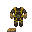

# Охотник

<include path='roles/template-roles-list'
         department-color='cargo'
         department-name='Карго'
         department-url='/roles/cargo'
         char-img='./hunter/char.png'
         name='Охотник'
         prop-difficulty="Сложная"
         prop-responsibilities='Обучение и помощь <a href="/roles/cargo/utilizer">утилизаторам</a>.'
         prop-command='<a href="/roles/command/quartimaster">Квартирмейстер</a>'
				 prop-guides=''/>

**Охотник** - сотрудник отдела снабжения, который должен обучать новичков своего отдела.

**Минимальные требования:** Хорошо знать работу отдела снабжения. Обучать [утилизаторов](). Помогать сотрудникам своего отдела.

##  Обучение 

Вы должны обучать новых [утилизаторов]() работе. Не поленитесь спросить, кому из них требуется обучение.

* Первым делом **объясните** вкратце суть вашей работы, используя эту статью.
* **Объясните** взаимодействия со средой, как правильно пользоваться скафандром, балоном и маской, а также магнитными ботинками.

Снаряжение

<table style="background-color:#ad5313;">
<tbody>
<tr>
<th style="background-color:#ad5313;">Изображение</th>
<th style="background-color:#ad5313;">Название</th>
<th style="background-color:#ad5313;">Описание</th>
</tr>
<tr>
<th>
<figure class="image"></figure>
</th>
<th><strong>Скафандр утилизатора</strong></th>
<th>ССкафандр утилизатора здорового человека - имеет нормальную броню, в отличие от лёгкого скафандра. Встроенный фонарь светит на 10 тайлов, как фонарик СБ. Штатно обычно не выдаётся, но его можно найти на обломках или в укромных местах станции.</th>
</tr>
<tr>
<th>
<figure class="image"> </figure>
</th>
<th><strong>Лёгкий скафандр утилизатора</strong></th>
<th>То самое, что позволит утилизатору выйти в космос и не взорваться от недостатка давления. Защищает от всех видов урона чуть лучше, чем ничего - немного меньше процента от полученного урона. Встроенный фонарик светит на пару-тройку тайлов.</th>
</tr>
<tr>
<th>
<figure class="image"></figure>
</th>
<th><strong>Противогаз исследователя</strong></th>
<th>Брутально выглядящий противогаз, однако не более чем дыхательная маска. Ничтожно защищает от всех видов урона, кроме радиации - чуть меньше процента от общего урона.</th>
</tr>
<tr>
<th>
<figure class="image"></figure>
</th>
<th><strong>Кислородный / азотный баллон</strong></th>
<th>

Чтобы выжить в космосе дольше минуты, вам понадобится кислородный баллон. Экипируйте его в руку, карман или отсек для хранения костюма, чтобы иметь возможность правильно использовать его с вашим противогазом. Важно: азотом дышат только слаймолюды.

</th>
</tr>
<tr>
<th>
<figure class="image"> </figure>
</th>
<th><strong>Магнитные ботинки</strong></th>
<th>Позволят вам не потерять твёрдый пол под ногами даже в отсутствие гравитации. Можно и без них, но они очень облегчают жизнь утилизатора.</th>
</tr>
</tbody>
</table>

---

* **Объясните** работу с вашим боевым и вспомогательным снаряжением, а также рацией.

Инструменты

<table style="background-color:#ad5313;">
<tbody>
<tr>
<th style="background-color:#ad5313;">Изображение</th>
<th style="background-color:#ad5313;">Название</th>
<th style="background-color:#ad5313;">Описание</th>
</tr>
<tr>
<th>
<figure class="image"></figure>
</th>
<th><strong>Протокинетический ускоритель</strong></th>
<th>То единственное оружие, которое позволит утилизатору бить карпов на расстоянии. Перезаряжается 2-3 секунды и стреляет бесконечными кинетическими болтами, нанося по 10 механического урона.</th>
</tr>
<tr>
<th>
<figure class="image"></figure>
</th>
<th><strong>Нож для выживания</strong>
</th><th>Малюсенький ножик для битвы с опасностями космоса врукопашную. Нелеп тем фактом, что ранит слабее, чем простой кухонный нож, нанося всего 10 урона колото-резаной раной.</th>
</tr>
<tr>
<th>
<figure class="image"></figure>
</th>
<th><strong>Кирка</strong></th>
<th>Шахтёрская кирка. Несмотря на сотни поколений старателей, она всё та же. Позволяет раздолбить астероидную породу, добыв с некоторым шансом какую-либо руду.</th>
</tr>
<tr>
<th>
<figure class="image"></figure>
</th>
<th><strong>Сумка для руды</strong></th>
<th>Действительно специальная сумка для переноски руды. Вмещает достаточно много.</th>
</tr>
<tr>
<th>
<figure class="image"></figure>
</th>
<th><strong>Глобальная система позиционирования (ГСП)</strong></th>
<th>Аналог GPS/Глонасс в космосе. Показывает текущее местоположение в виде пары координат. Рекомендуется брать с собой в каждый поход, так как утилизаторы часто теряются.</th>
</tr>
<tr>
<th>
<figure class="image"></figure>
</th>
<th><strong>	Огнетушитель</strong></th>
<th>Временно (но иногда обстоятельства вынуждают постоянно) используется утилизаторами в качестве средства передвижения по космосу, пока не доставят джеты. Выпуск пены толкает человека в противоположную сторону.</th>
</tr>
<tr>
<th>
<figure class="image"></figure>
</th>
<th><strong>Лопата</strong></th>
<th>Просто лопата...</th>
</tr>
<tr>
<th>
<figure class="image"></figure>
</th>
<th><strong>Пояс с инструментами</strong></th>
<th>Обычно полностью укомплектован отверткой, сварочным аппаратом, гаечным ключом, ломом, многофункциональным инструментом и кусачками. Используйте эти инструменты, если хотите достать закрепленные предметы или преодолеть препятствия, такие как закрытые двери.
</th>
</tr>
</tbody>
</table>

---

* После стыковки утилизационного шаттла с отделом снабжения, во время перетаскивания машин, консолей и торговых автоматов **следует объяснять** их значение для вашей работы.
* Во время запасания медикаментами и оружием **следует объяснить**, как ими пользоваться.
* После переноса и перепроверки наличия требуемого снаряжения **следует обучить** новичка управлению вашим шаттлом.
* Затем **сходите** вместе с новичком **на обломки**. Следите за ним, отвечайте на его вопросы, объясняйте работу с обломками.
* Если практика на обломках оказалась удачной, **можно выбрать** экспедицию легкого уровня, для ознакомления новичка с ними.
* После, **следует повторить** экспедиционную практику на среднем уровне.
* Затем **продолжайте** обычную утилизаторскую **работу**. **Следите** за новичком, **помогайте** ему.

## 

Помогайте сотрудникам отдела снабжения. Давайте советы [утилизаторам](). Поинтересуйтесь, нужно ли что-нибудь сотрудникам вашего отдела. Перепроверьте наличие медикаментов, оружия, инструментов и нужных машин на шаттле утилизации. Посоветуйтесь с каждым из вашей команды на счет выбора экспедиции.

##  Ваш инвентарь

С начала смены вы обладаете боевым ножом, поясом для инструментов, старомодным лазерным пистолетом, а также особым скафандром.

Он:

* Понижает вашу скорости на **5%**
* Защищает от **тупого** урона на **15%**
* Защищает от **рубящего** урона на **15%**
* Защищает от **проникающего** урона на **15%**
* Защищает от **радиационного** урона на **55%**
* Защищает от **кислотного** урона на **15%**

## Вы не глава

Вы, как охотник, не являетесь главой своего отдела. Функцию координирования отдела выполняет [Квартимейстер ](/roles/quartermaster). По лестнице подчинения вы равны утилизаторам, не забывайте об этом.

[**Профессии экипажа**](/roles)

**Командование**

[Капитан](/roles/captain)
[Глава персонала](/roles/headofpersonnel)
[Глава Службы Безопасности](/roles/headofsecurity)
[Инспектор](/roles/inspector)
[Старший Инженер](/roles/chiefengineer)
[Научный Руководитель](/roles/researchdirector)
[Старший Медицинский Офицер](/roles/chiefmedicalofficer)
[Квартирмейстер](/roles/quartermaster)

**Центральное Командование**

[Представитель ЦК](/roles/representativeofcc)
[Отряд Быстрого Реагирования](/roles/emergencyresponseteam)
[Отряд Смерти](/roles/deathsquad)

**Служба безопасности**

[Глава Службы Безопасности](/roles/headofsecurity)
[Смотритель](/roles/warden)
[Ветеран](/roles/veteran)
[Офицер](/roles/officer)
[Детектив](/roles/detective)
[Кадет](/roles/cadet)

**Инженерный отдел**

[Старший Инженер](/roles/chiefengineer)
[Бригадир](/roles/brigadier)
[Инженер](/roles/engineer)
[Атмосферный техник](/roles/atmospherictechnician)
[Технический ассистент](/roles/technicalassistant)

**Отдел Исследований**

[Научный Руководитель](/roles/researchdirector)
[Ведущий исследователь](/roles/leadresearcher)
[Учёный](/roles/scientist)
[Научный ассистент](/roles/researchassistant)

**Медицинский отдел**

[Старший Медицинский Офицер](/roles/chiefmedicalofficer)
[Медицинский офицер](/roles/medicalofficer)
[Парамедик](/roles/paramedic)
[Химик](/roles/chemist)
[Врач](/roles/doctor)
[Интерн](/roles/intern)

**Отдел снабжения**

[Квартирмейстер](/roles/quartermaster)
[Охотник](/roles/hunter)
[Утилизатор](/roles/utilizer)
[Грузчик](/roles/loader)

**Отдел юстиции**

[Инспектор](/roles/inspector)
[Юрист](/roles/lawyer)

**Сервисный отдел**

[Глава персонала](/roles/headofpersonnel)
[Ассистент](/roles/assistant)
[Сервисный работник](/roles/serviceworker)
[Ботаник](/roles/botanist)
[Шеф-повар](/roles/chef)
[Бармен](/roles/barman)
[Уборщик](/roles/janitor)
[Клоун](/roles/clown)
[Мим](/roles/mime)
[Зоотехник](/roles/zootechnik)
[Боксёр](/roles/boxer)
[Репортёр](/roles/reporter)
[Священник](/roles/priest)
[Библиотекарь](/roles/librarian)
[Музыкант](/roles/musician)

**Спиритический отдел**

[Призрак](/roles/ghost)
[Пун Пун](/roles/punpun)
[Мышь](/roles/mouse)
[Гамлет](/roles/hamlet)
[Ремилия](/roles/remilia)

**Синтетики**

[Киборг](/roles/cyborg)
[пИИ](/roles/personalai)
[Дрон техобслуживания](/roles/maintenancedrone)

**Антагонисты**

[Предатель](/roles/traitor)
[Ядерный оперативник](/roles/nuclearoperative)
[Космическая аскарида](/roles/corticalBorer)
[Вор](/roles/thief)
[Культист](/roles/cultist)
[Революционер](/roles/revolution)
[Нулевой пациент](/roles/patientzero)
[Космический ниндзя](/roles/spaceninja)
[Пират](/roles/pirate)
[Ревенант](/roles/revenant)
[Крысиный король](/roles/ratking)
[Космический дракон](/roles/spacedragon)
[Хранитель](/roles/guardian)
[Генокрад](/roles/genestealer)
[Терминатор](/roles/terminator)