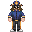
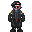
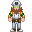
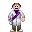
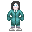
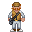
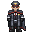

# Командование станции

[Капитан](/roles/captain)

Подчиняется:

ЦентКом

Описание:

Глава объекта. Занимается руководством всей станции, главные его помощники это главы отделов.
 [Иерархия Командования](/guides/hierarchyofcommand) • [Особо ценные предметы](/guides/especiallyvaluableitems)

[Глава персонала](/roles/headofpersonnel)

Подчиняется:

Капитан

Описание:

Руководит отделом Сервиса. Принимает и увольняет работников, редактирует доступ ID-карт.
 [Иерархия Командования](/guides/hierarchyofcommand)

[Глава Службы Безопасности](/roles/headofsecurity)

Подчиняется:

Капитан

Описание:

Управляет отделом жалких породий на клоуна. Хранит диск за капитана.
 [Иерархия Командования](/guides/hierarchyofcommand) • [Космический Закон](/spacelaw) • [Офицерство](/guides/officership)

[Старший Инженер](/roles/chiefengineer)

Подчиняется:

Капитан

Описание:

Управляет инженерным отделом и следит за сохранностью станции.
 [Иерархия Командования](/guides/hierarchyofcommand) • [Инженерия](/guides/engineering) • [Сингулярный двигатель](/guides/singularengine) • [Двигатель антиматерии](/guides/antimatterengine) • [Суперматерия](/guides/supermatter) • [Трубы](/guides/pipes) • [Шаттлостроение](/guides/shuttlebuilding)

[Научный Руководитель](/roles/researchdirector)

Подчиняется:

Капитан

Описание:

Глава исследований и разработки. Следит за работой отдела, а также за выполнением их задач.
 [Иерархия Командования](/guides/hierarchyofcommand) • [Ксеноархеология](/guides/xenoarcheology) • [Аномалии](/ru/guides/anomalies) • [Боргостроение](/guides/borgcreating) • [Робототехника](/guides/robotics) • [Экзокостюмы](/guides/exosuits)

[Старший Медицинский Офицер](/roles/chiefmedicalofficer)

Подчиняется:

Капитан

Описание:

В начале смены отдыхает, а к концу пытается избавиться от трупов на полу, вместе со всем мед отделом.
 [Иерархия Командования](/guides/hierarchyofcommand) • [Медицина](/guides/medicine) • [Химия](/guides/chemistry) • [Медицинский инвентарь](/guides/medicalequipment)

[Квартирмейстер](/roles/quartermaster)

Подчиняется:

Капитан

Описание:

Следит за работой отдела, несет ответственность за шаттл карго, а также должен одобрять или отклонять запросы.
 [Иерархия Командования](/guides/hierarchyofcommand) • [Советы по Карго](/guides/workincargo) • [Список товаров](/guides/listofproducts)

[Инспектор](/roles/inspector)

Подчиняется:

Капитан

Описание:

Контролирует выполнение целей станции. А также всеми юридическими вопросами.
 [Иерархия Командования](/guides/hierarchyofcommand)

# Введение

Все, кроме капитана являются Главами отделов. Каждый из них имеет доступ к Мостику и может сделать объявление или вызывать/отозвать шаттл при помощи Консоли Коммуникаций.

##  [Капитан](/roles/captain)

Вы - капитан станции, верхушка в пищевой цепочке командования. Ваша обязанность - обеспечить стабильность и работоспособность станции, а также выполнять указания Центрального Командования.

Вы должны иметь опыт работы на всех руководящих должностях. В начале раунда возьмите с собой Диск Ядерной Аутентификации, свяжитесь с Главами и проведите небольшой брифинг, продолжайте время от времени проверять, что все работает как часы.

## Бытие Ивана Грозного...

У Капитана есть просторная каюта, в комплекте с которой идут: Идентификационная и Коммуникационная Консоли, Диск Ядерной Аутентификации.

В начале смены возьмите ваш запасной ID, Диск Ядерной Аутентификации и положите их в рюкзак. Передайте Пинпоинтер [Главе Службы Безопасности](/roles/headofsecurity). После этого вы вольны делать все, что посчитаете нужным.

## Я - око станции...

Когда вы не сражаетесь с революционерами или [предателями](/roles/traitor), вы наблюдаете за экипажем. Находясь на вершине пищевой цепочки и обладая высшей властью над всеми и всем на вашей станции.

Вы - Судья, последнее слово всегда за вами. У вас есть право вето по всем вопросам и вы - единственный человек, который может санкционировать казнь без суда. Технически любого, кто сомневается в вашем авторитете, можно судить за мятеж. На самом деле невозможно точно сказать, как управлять делами, поскольку у многих людей разные стили руководства. Однако, как Капитан, вы должны помнить несколько вещей:

* 1. Не работайте сами, когда есть кто-то другой, готовый выполнить эту работу. Зачем нужен ХоС, если вы собираетесь заниматься всеми вопросами безопасности? Если в определенном отделе нет руководителя, назначьте нового. Это сделает вашу жизнь намного проще.
* 2. Приказывайте! И вам никогда не придется выполнять какие-либо задачи самому. Если кто-то скажет: «Капитан, плазма в коридорах!» тогда вы должны приказать своему главному инженеру разобраться с этим. Не работайте сами, зачем вам остальной экипаж? Делегирование - один из ключей к успешному лидерству.
* 3. Следуйте цепочке командования. Вы приказываете Главам отделов. Они управляют своими отделами и отдают приказы ниже. Старайтесь не пропускать глав в процессе принятия решений, поскольку именно они "должны" знать свои собственные отделы лучше всего.
* 4. Будьте начеку. У вас на спине большая мишень. Скорее всего, вы станете главной целью Предателей только из-за вашего ID с полным доступом.
* 5. Сохраняйте спокойствие. Как Капитан, будьте готовы иметь дело с одним или со всеми из следующих утверждений: некомпетентные или отсутствующие Главы, Предатели и разъяренные ассистенты, неисправный ИИ, наплевательское отношение на права экипажа со стороны Службы Безопасности (СБ) и многое другое. И твоя работа - управлять всем этим. Удачи.

## Медиков нет? ЗАПРАШИВАЕМ ШАТТЛ!

Покинуть корабль!
Капитаны нередко предстают перед военным трибуналом или бывают даже казнены, если они решатся покинуть "свой корабль", независимо от состояния. Поскольку они несут полную ответственность за станцию и её экипаж, их потеря может быть воспринята вашим начальством как дезертирство и/или мятеж.

Отзовите эвакуационный шаттл, если вы не давали своего разрешения. Вы должны делать все возможное, чтобы станция функционировала.

##  [Глава Персонала](/roles/headofpersonnel)

Глава Персонала ответственен за кадровые вопросы и оптимизацию работы всех департаментов. На его плечах лежит увольнение и назначение сотрудников. ХоП находится на одном уровне с другими [Главами отделов](/roles#command), но он единственный, кроме [Капитана](/roles/captain), у кого есть доступ к терминалу изменения ID-карт.

*Более подробней о должности на* [*странице сервиса*](/roles/servicedepartment)

##  [Глава Службы Безопасности](/roles/headofsecurity)

Вы несете ответственность за порядок на корабле, а не создаете свою военную диктатуру. Вы, как ХоС, должны координировать действия офицеров и других сотрудников брига, создать благоприятную и безопасную атмосферу на корабле. Запомните что вы - командир своего отдела, вы не должны выполнять работу своих сотрудников за них, если конечно это вас не вынуждают обстоятельства. Вы несете ответственность за действия сотрудников вашего отдела, и можете быть отчитаны за их некомпетентность.

*Более подробней о должности на* [*странице службы безопасности*](/roles/securityservicedepartment)

##  [Старший Инженер](/roles/chiefengineer)

Вы являетесь руководителем [инженерного отдела](/roles/engineeringdepartment), в состав которого входят не только инженеры, но также и атмосферные техники. Ваша задача управлять инженерным отделом, убедиться, что Сингулярность, ДАМ или Солнечные Панели правильно подключены, настроены и запущены, а атмосфера запитана и постоянно наполняет отсеки чистым воздухом.

*Более подробней о должности на* [*странице инженерного отдела*](/roles/engineeringdepartment)

##  [Научный Руководитель](/roles/researchdirector)

Как научный руководитель, вы должны организовать процесс исследований в научном отделе. В таком случае, задача будет выглядеть так - не дать своим подчиненным случайно убить себя. 
Также Вы самый главный эксперт по всем странным феноменам на станции. Когда случается что-то странное, то это ваша работа разобраться в том как лучше решить эту проблему. Остальные Главы Отделов будут доверять вашей информации о происходящем.

*Более подробней о должности на* [*странице научного отдела*](/roles/scientificdepartment)

##  [Старший Медицинский Офицер](/roles/chiefmedicalofficer)

Ваша задача - убедиться, что все остальные в мед отделе выполняют свою работу, а не находятся на поле боя. Вы можете взять на себя ответственность за что-то или кого-то, если возникнет чрезвычайная ситуация, но в противном случае вы всего лишь администратор, который консультирует и помогает коллегам, а не полевой медик и эскулап.

*Более подробней о должности на* [*странице медицинского отдела*](/roles/medicaldepartment)

##  [Квартирмейстер](/roles/quartermaster)

Как квартирмейстер, ваша основная задача - заказывать оборудование, чтобы поддерживать станцию в рабочем состоянии. В вашем распоряжении грузчики, которые помогут вам распределять товары по станции. Вы также обязаны координировать утилизаторов для добычи предметов на обломках, чтобы удовлетворить потребности станции.

*Более подробней о должности на* [*странице снабжения*](/roles/supplydepartment)

##  [Инспектор](/roles/inspector)

Вы — Инспектор, вам предстоит следить за выполнением целей станции, создавать отчеты по запросу от Центрального Командования и Капитана, разрешать внутренние конфликты на станции и руководить отделом юстиции.

*Более подробней о должности на* [*странице юстиции*](/roles/justicedepartment)