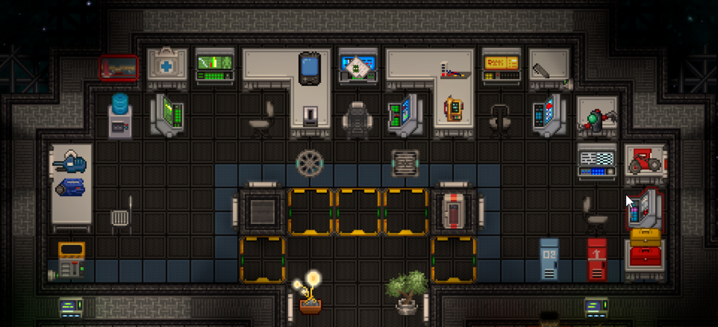
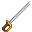

# Капитан

<include path='roles/template-role-passport'
         department-color='command'
         department-name='Коммандование'
         department-url='roles/command'
         char-img='roles/command/captain/char.png'
         name='Капитан'
         prop-difficulty="Сложная"
         prop-responsibilities='Глава объекта. Занимается руководством всей станции.'
         prop-command='<a href="/roles/centcomm">ЦентКом</a>'
				 prop-guides=''/>

Вы — капитан, верхушка в [цепочке командования](/guides/hierarchyofcommand). Ваша обязанность — обеспечивать стабильность и эффективность работы станции, а также выполнять распоряжения [ЦентКома](/roles/centralcommand).

У вас должен быть опыт работы на всех руководящих должностях. В начале смены **возьмите с собой диск Ядерной Аутентификации**, проведите небольшой брифинг по радиосвязи со своими главами и время от времени проверяйте, что все работает как часы.

**Минимальные требования:** Защитите этот чертов диск и свой полный доступ. Используйте свои полномочия только тогда, когда это необходимо, главы отделов существуют не просто так.

## Добро пожаловать на борт!

###  Бытие Капитана — основы

У капитана есть просторная каюта, в комплекте с которой идут: идентификационная и коммуникационная консоли, [джетпак](/guides/especiallyvaluableitems), [диск ядерной аутентификации](/guides/especiallyvaluableitems), лучший бронированный скафандр на станции и ваша гордость — [наградной антикварный лазерный пистолет](/guides/especiallyvaluableitems).

В начале смены возьмите диск ядерной аутентификации и положите его в рюкзак. Если вы это сделали, вы уже выполнили половину своей работы. Если вы чувствуете себя особенно уязвимым, отдайте свой пинпоинтер [Главе Службы Безопасности](/roles/headofsecurity). После этого ходите по станции и командуйте людьми — вы ведь Капитан.

[**Взгляните на все уникальное снаряжение здесь.**](/guides/especiallyvaluableitems)

Цель станции

**Доброе утро, главы.**
Если вы это читаете, значит запуск станции прошел успешно и вы уже прибыли на своё рабочее место в составе ранней группы. Если нет, то этот документ будет ждать вашего прибытия на транспортном шаттле.

---

Мы поздравляем вас с началом работы в нашем экспериментальном проекте. Цель данной станции - изучить перспективы долгосрочного функционирования научных станций в качестве автономных объектов. Поэтому, вам, как главам, выдается полный карт-бланш на развитие, доработку и организацию деятельности своих отделов и отсеков станции.

---

**От вас ожидается:**
Инициативность и отработка разнообразных подходов к управлению персоналом, технической модификации ввереной вам станции и оснащению отделов.

---

Статистические данные, собранные со станций вашего типа, будут переданы в отдел аналитики НаноТрейзен для дальнейшего изучения. Эксперементируйте и проявляйте свои лидерские качества, ваша инициативность и творческий подход - то что нам необходимо.Мы гордимся вами, и помните: за нами - человечество.

---

P.S: *Отдел кадров испытывает трудности с набором квалифицированных сотрудников, поэтому мы прибегли к эстренным мерам. В случае обнаружения возможного предателя или работника, знания которого не соответствуют его должности, действуйте по обстановке.*

---

P.P.S: *Ожидайте возможные дополнительные задачи. Если они появятся, мы выйдем с вами на связь.*

###  Глава Глав

Когда вы не сражаетесь с предателями, Синдикатом и зараженными зомби-вирусом офицерами, вы следите за работой экипажа. Вы находитесь на вершине пищевой цепочки и обладаете высшей властью над всеми и всем на вашей станции.

Вы — Судья, последнее слово, Большой Парень. Вы обладаете абсолютным правом вето по всем вопросам и являетесь единственным человеком, который может санкционировать казнь без суда. Любой, кто оспаривает вашу власть, может быть технически предан суду за мятеж. Невозможно точно сказать, как управлять кораблем, поскольку у многих людей разные стили руководства. Однако как капитан, вы должны помнить о некоторых рекомендациях:

1. **Не вовлекайте себя, если есть кто-то другой, кто может выполнить эту работу.** Зачем нужен [Глава Службы Безопасности](/roles/headofsecurity), если вы сами собираетесь заниматься всеми вопросами безопасности? Если нет руководителя для конкретного отдела, назначьте нового. Это сделает вашу жизнь намного проще и интереснее.
2. **Делегируйте полномочия, когда это возможно.** Вы никогда не должны выполнять ручную работу самостоятельно. Если кто-то скажет: «Капитан, плазма в коридорах!», вы должны приказать своему [Старшему Инженеру](/roles/chiefengineer) разобраться с этим. Не пытайтесь исправить это самостоятельно, так как вы подвергнете себя ненужному риску
3. **Следуйте** [**цепочке командования**](/guides/hierarchyofcommand)**.** Вы командуете Главами. Главы командуют своими отделами. Старайтесь не игнорировать их в процессе принятия решений, поскольку именно они *должны* лучше всех знать свои отделы.
4. **Будьте бдительны.** У вас есть большая мишень на спине. Вполне, вероятно, что вы станете главной целью для предателей только из-за вашей карты с полным доступом. Учитывая это, вы, возможно, захотите провести достаточно много времени, отдыхая в безопасности на мостике.
5. ***Сохраняйте спокойствие и продолжайте в том же духе**.* Как Капитан, будьте готовы иметь дело с любым или сразу всеми следующими ситуациями: некомпетентные или отсутствующие Главы, предатели и разъяренные члены экипажа, ломящиеся в дверь мостика, пытаясь попасть внутрь, новички в службе безопасности, и иногда последствия армагеддона, обрушившегося на станцию благодаря целому ряду вышеперечисленных факторов. И ваша задача — управлять всем этим. Удачи.

---

###  Эти засранцы из NanoTrasen...

С вашим престижным титулом, медалями и роскошными излишествами легко забыть, что есть внешняя, [Высшая сила](/rules), внимательно следящая за каждым вашим шагом.

Контакты с [ЦК](/roles/centralcommand) могут быть редкими, но от вас ожидается, что вы будете следовать любым приказам, выданным ими. ЦентКом обычно издает директивы и обновляет информацию о деятельности в вашем секторе через консоль связи, расположенную на мостике и в вашем офисе.

Если вам не повезет, возможно, вам придется столкнуться с визитом [представителя ЦК](/roles/representativeofcc) или даже Командором. Визиты ревизоров могут быть самыми разными — от стандартных аттестаций, внутренних расследований или других видов корпоративного вмешательства. Каким бы ни был случай, важно, чтобы вы постарались сделать так, чтобы офицер ЦК остался доволен на протяжении всего визита. Если ничего не получится, просто убедитесь, что вас нельзя обвинить в том, что что-то пошло не так.

Однако имейте в виду, что вы по-прежнему обладаете властью над всеми должностными лицами на вашей станции. То есть до тех пор, пока вы остаетесь законным капитаном. Если вы разозлите не того человека, вы можете оказаться отстраненным от командования. Однако если сам представитель создает проблемы, вы имеете полное право арестовать его, а затем обратиться к ЕГО начальству с жалобой.

Если вы каким-то образом действительно разозлили и офицера ЦК, и его командование, начинайте беспокоиться. Многие капитаны были магическим образом дез интегрированы в собственных каютах за то, что они вели себя как [полоумные](/roles/clown).

Связаться с ЦК самостоятельно можно с помощью консолей связи, но если передача не срочная, она, скорее всего, на несколько недель застрянет в пресловутой бюрократии NanoTrasen. Даже в этом случае, это очень ненадежно и вас могут проигнорировать.

---

###  Покинуть корабль!

**В конечном итоге вы несете ответственность за станцию.** Нередко капитанов отдают под трибунал или даже казнят, если они решают покинуть свой корабль, независимо от его состояния. Поскольку на них лежит конечная ответственность за станцию и ее экипаж, их потеря может быть воспринята вашим начальством как дезертирство, мятеж и/или подстрекательство к мятежу.

Поэтому помните об этом, когда столкнетесь с бедствием. Не допускайте эвакуации без вашего прямого разрешения. ***Вы должны делать все возможное для поддержания станции в рабочем состоянии.*** - чтобы не пойти на дно вместе с ней, так или иначе.

---

###  Когда все пошло не по плану

Ваша золотая карта обеспечивает вам полный доступ к функционалу консоли коммуникации. А это значит, что вы можете вызывать [подкрепления с ЦК](/roles/emergencyresponseteam), изменять код безопасности и оповещать всю станцию. Но заострим внимание на одном из самого важного - вашей связью с ЦК и вызовом подмоги. Для связи с Центкомом необходимо отправить объявление станции, обращаясь к ЦК. В зависимости от ситуации на станции и качеством вашего сообщения, на станцию может быть выслан отряд быстрого реагирования... или не выслан...

Всего существует 2 вида отрядов:

* Вызов отряда РХБЗ. Если на станции уже 40 минут буйствует орда превращенных в зомби ботаников, поваров, барменов, уборщиков, ученых и множества других биологически опасных существ - вы можете запросить специальный отряд для устранения данной проблемы. Слабо вооруженные, но крайне полезные в такой период времени, они смогут взять ситуацию под контроль и обезопасить эвакуацию выживших.
* Вызов отряда быстрого реагирования. Элитная группа бойцов Центрального Командования, способная побороть любую угрозу. Вызывается в самых запущенных случаях и обладает крайне сильным арсеналом. Защищенные не замедляющими скафандрами и вооруженные импульсными винтовками, они убьют вас за несколько выстрелов, если захотят.

Вы также можете обращаться в ЦК с любой другой просьбой, через ту же систему оповещений. Не забывайте, что вы один из двух лиц на станции, кто находится ближе всего к ЦК.

---

##  "Полезные" советы

* Как капитан, вы всегда должны иметь при себе ядерный диск: Начальник Охраны появляется с пинпоинтером, чтобы он мог найти ваш неизбежный труп.
* Никогда, НИКОГДА не кладите Диск в свой шкаф. Любой, кому он может понадобиться, сможет легко достать его при помощи взрывчатки или даже обычного ящика с инструментами.
* Не сходите с ума и не убегайте в одиночку в бой. Вы не армия одного человека, и ни у кого на станции нет доступа вашего уровня. Если вы броситесь сломя голову в медбей, где орудует толпа Агентов Синдиката, и обнаружите, что у остальной охраны нет доступа, чтобы пройти через входные двери и помочь вам, это может быстро привести к катастрофе.

[**Профессии экипажа**](https://js.ss14.su/roles)

**Командование**

[Капитан](/roles/captain)
[Глава персонала](/roles/headofpersonnel)
[Глава Службы Безопасности](/roles/headofsecurity)
[Инспектор](/roles/inspector)
[Старший Инженер](/roles/chiefengineer)
[Научный Руководитель](/roles/researchdirector)
[Старший Медицинский Офицер](/roles/chiefmedicalofficer)
[Квартирмейстер](/roles/quartermaster)

**Центральное Командование**

[Представитель ЦК](/roles/representativeofcc)
[Отряд Быстрого Реагирования](/roles/emergencyresponseteam)
[Отряд Смерти](/roles/deathsquad)

**Служба безопасности**

[Глава Службы Безопасности](/roles/headofsecurity)
[Смотритель](/roles/warden)
[Ветеран](/roles/veteran)
[Офицер](/roles/officer)
[Детектив](/roles/detective)
[Кадет](/roles/cadet)

**Инженерный отдел**

[Старший Инженер](/roles/chiefengineer)
[Бригадир](/roles/brigadier)
[Инженер](/roles/engineer)
[Атмосферный техник](/roles/atmospherictechnician)
[Технический ассистент](/roles/technicalassistant)

**Отдел Исследований**

[Научный Руководитель](/roles/researchdirector)
[Ведущий исследователь](/roles/leadresearcher)
[Учёный](/roles/scientist)
[Научный ассистент](/roles/researchassistant)

**Медицинский отдел**

[Старший Медицинский Офицер](/roles/chiefmedicalofficer)
[Медицинский офицер](/roles/medicalofficer)
[Парамедик](/roles/paramedic)
[Химик](/roles/chemist)
[Врач](/roles/doctor)
[Интерн](/roles/intern)

**Отдел снабжения**

[Квартирмейстер](/roles/quartermaster)
[Охотник](/roles/hunter)
[Утилизатор](/roles/utilizer)
[Грузчик](/roles/loader)

**Отдел юстиции**

[Инспектор](/roles/inspector)
[Юрист](/roles/lawyer)

**Сервисный отдел**

[Глава персонала](/roles/headofpersonnel)
[Ассистент](/roles/assistant)
[Сервисный работник](/roles/serviceworker)
[Ботаник](/roles/botanist)
[Шеф-повар](/roles/chef)
[Бармен](/roles/barman)
[Уборщик](/roles/janitor)
[Клоун](/roles/clown)
[Мим](/roles/mime)
[Зоотехник](/roles/zootechnik)
[Боксёр](/roles/boxer)
[Репортёр](/roles/reporter)
[Священник](/roles/priest)
[Библиотекарь](/roles/librarian)
[Музыкант](/roles/musician)

**Спиритический отдел**

[Призрак](/roles/ghost)
[Мышь](/roles/mouse)
[Гамлет](/roles/hamlet)
[Ремилия](/roles/remilia)

**Синтетики**

[Киборг](/roles/cyborg)
[пИИ](/roles/personalai)
[Дрон техобслуживания](/roles/maintenancedrone)
[Искусственный Интеллект](/roles/ai)

**Антагонисты**

[Предатель](/roles/traitor)
[Ядерный оперативник](/roles/nuclearoperative)
[Мозговой червь](/roles/corticalBorer)
[Вор](/roles/thief)
[Культист](/roles/cultist)
[Революционер](/roles/revolution)
[Нулевой пациент](/roles/patientzero)
[Космический ниндзя](/roles/spaceninja)
[Пират](/roles/pirate)
[Ревенант](/roles/revenant)
[Крысиный король](/roles/ratking)
[Космический дракон](/roles/spacedragon)
[Хранитель](/roles/guardian)
[Генокрад](/roles/genestealer)
[Терминатор](/roles/terminator)