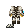
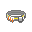
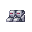

<include path='roles/template-role-passport'
         department-color='command'
         department-name='Командование'
         department-url='roles/command'
         char-img='roles/command/cheifengineer/char.png'
         name='Старший Инженер'
         prop-difficulty="Сложная"
         prop-responsibilities='Управлять инженерным отделом и следить за сохранностью станции.'
         prop-command='<a href="/roles/command/captain">Капитан</a>'
				 prop-guides=''></include>

## В начале раунда

Приветствуйте вашу команду по рации и установите свой авторитет. Узнайте, с кем вы будете работать и убедитесь, что у каждого есть своя работа. Назначьте кого-нибудь, кто будет подключать солнечные панели, и заставьте остальных работать над подключением и настройкой сингулярности и ДАМ.

Если вы возьмете на себя командование этими первыми минутами раунда, большинство инженеров будут выполнять остальные приказы до конца раунда. Если вы будете молчать, то когда вам вдруг понадобится что-то сделать в середине раунда, можно гарантировать, что никто вас не послушает и не даже не узнает в вас своего начальника.

В большинстве случаев ваша команда будет достаточно компетентна, и вам нужно будет только наблюдать, но иногда вам придется вмешаться. Прочитайте руководства и убедитесь, что вы знаете обо всём вдоль и поперёк. Если в команде оказался новичок, помогите ему освоиться и покажите основы. Если кто-то ведет себя как идиот, просто накричите на него и принудительно понизьте в должности, если он продолжит. Помните, что сингулярность является неотъемлемой частью электроснабжения станции и обязана быть настроена. При успешной настройке можете похвастаться своей успешной работой экипажу по рации

## Атмосферный отсек

Сингулярность запущена, солнечные панели настроены, ДАМ готов к работе в любую секунду. Кажется, что задачи старшего инженера на этом закончились, НО, нет. Вам необходимо проверить [атмосферный отсек](/guides/pipes), который дарит станции чистый воздух.

Если вы не разбираетесь в атмосии - не стоит играть за СЕ! Нужно регулярно заходить туда, проверять фильтры, насосы, давление, не пускают ли плазму, в общем всё. Если [атмосферные техники](/roles/atmospherictechnician) не разбираются в этой паутине из труб, то ничего удивительного, вам придётся самим его настраивать.

## Снаряжение

| Снаряжение | Описание |
| --- | --- |
|  Скафандр старшего инженера | Специальный костюм, защищающий от опасной среды с низким давлением и с помощью которого можно отличить обычного инженера от старшего. **Характеристики:**  * Тупой 15% * Рубящий 15% * Проникающий 20% * Тепловой 60% * Радиационный 100% * Кислотный 15% * Взрывной 80% * Понижает скорость ходьбы на 20%, понижает скорость ходьбы на 25%. |
|  Пояс старшего инженера | Стильно держит инструменты. Имеет вместимость в 105 единиц. Изначально содержит в себе 6 предметов: |
|  Электродрель | Простая дрель с электроприводом. Занимает 10 единиц места на поясе. Имеет 2 режима работы: "Свинчивание"(замена отвёртки) и "Закрепление"(замена гаечного ключа). Их можно переключать нажатием кнопки `Z`. |
|  Челюсти жизни | Набор челюстей жизни, сжатых с помощью магии науки. Занимает 50 единиц места на поясе. Имеет 2 режима работы: "Монтирование"(замена лома) и "Резка"(замена кусачек). Может открывать двери с питанием в режиме "Монтирование". |
|  Экспериментальный сварочный аппарат | Экспериментальный сварочный аппарат, способный самостоятельно вырабатывать топливо. Занимает 10 единиц места на поясе. Имеет в запасе 1000 единиц топлива. Включить сварочный аппарат можно на кнопку "Я". В ближнем бою: при выключенном состоянии даёт 10 единиц тупого урона, при включённом состоянии даёт 10 единиц теплового урона. |
|  Мультитул | Современный инструмент для копирования, хранения и передачи электрических импульсов и сигналов по проводам и машинам. Занимает 5 единиц места на поясе. При нажатии мультитулом по проводу показывает его напряжение. Может использоваться для взлома двери. |
|  Моток НВ проводов | Моток проводов для соединения АПЦ с устройствами, а также для других задач. Занимает 10 единиц места на поясе. Используется для создания самодельный наручников(makeshift handcuffs). Чтобы проложить провод, необходимо снять с пола плитку и нажать с выделенным в руках мотком провода. |
|  Network configurator | Новое устройство, необходимое чтобы связывать два устройства. Занимает 5 единиц места на поясе. Имеет два режима: "Link"(для создания связи между двумя объектами, например для консоли клонирования) и "List"(для создания связи между большим количеством объектов одновременно, например для воздушной сигнализации). |
|  Продвинутые магнитные сапоги | Новейшие магнитные ботинки, которые не замедляют своего владельца в включенном состоянии. |
|  Конфигуратор доступов | Конфигуратор доступов – инновационное устройство, созданное НТ для добавления и изменения доступа шлюзов, шкафов, автоматов и ящиков с замками. Для своей работы конфигуратор требует ID карту. Конфигуратор будет изменять только тот доступ, что имеется на вставленной ID. Для изменения доступа необходимо использовать конфигуратор на любом объекте, при этом появится специальное меню. При нажатии на любой доступ он появится или исчезнет у замка. ID должна иметь этот доступ для того, чтобы он изменился. Невозможно изменить доступ замка, если он имеет доступ, отсутствующий на ID.  **Примечания:**  Для взаимодействия с замком достаточно иметь всего один любой доступ из имеющихся на замке. То есть если добавить к дверям карго доступ ученых, то любой человек из рнд сможет спокойно ходить по отделу снабжения.  Можно изменять доступ к замку, взломанному ЕМАГом, но это ни на что не повлияет, и любой человек сможет взаимодействовать с объектом. |

## Полезные советы

* Скорее всего, в начале смены к вам пойдёт половина ассистенотов с вопросом "Можно изольки?". Ну... надеюсь вы не так глупы, чтобы отдать им их.
* Если к вам подошёл технический ассистент и попросил обучения, то смело направляйте его к Бригадиру.
* Обязательно проследите за сборкой каждого большого источника энергии, например, Суперматерия, Сингулярность или ДАМ. А ещё лучше, если вы сами их построите.

[**Профессии экипажа**](https://js.ss14.su/roles)

**Командование**

[Капитан](/roles/captain)
[Глава персонала](/roles/headofpersonnel)
[Глава Службы Безопасности](/roles/headofsecurity)
[Инспектор](/roles/inspector)
[Старший Инженер](/roles/chiefengineer)
[Научный Руководитель](/roles/researchdirector)
[Старший Медицинский Офицер](/roles/chiefmedicalofficer)
[Квартирмейстер](/roles/quartermaster)

**Центральное Командование**

[Представитель ЦК](/roles/representativeofcc)
[Отряд Быстрого Реагирования](/roles/emergencyresponseteam)
[Отряд Смерти](/roles/deathsquad)

**Служба безопасности**

[Глава Службы Безопасности](/roles/headofsecurity)
[Смотритель](/roles/warden)
[Ветеран](/roles/veteran)
[Офицер](/roles/officer)
[Детектив](/roles/detective)
[Кадет](/roles/cadet)

**Инженерный отдел**

[Старший Инженер](/roles/chiefengineer)
[Бригадир](/roles/brigadier)
[Инженер](/roles/engineer)
[Атмосферный техник](/roles/atmospherictechnician)
[Технический ассистент](/roles/technicalassistant)

**Отдел Исследований**

[Научный Руководитель](/roles/researchdirector)
[Ведущий исследователь](/roles/leadresearcher)
[Учёный](/roles/scientist)
[Научный ассистент](/roles/researchassistant)

**Медицинский отдел**

[Старший Медицинский Офицер](/roles/chiefmedicalofficer)
[Медицинский офицер](/roles/medicalofficer)
[Парамедик](/roles/paramedic)
[Химик](/roles/chemist)
[Врач](/roles/doctor)
[Интерн](/roles/intern)

**Отдел снабжения**

[Квартирмейстер](/roles/quartermaster)
[Охотник](/roles/hunter)
[Утилизатор](/roles/utilizer)
[Грузчик](/roles/loader)

**Отдел юстиции**

[Инспектор](/roles/inspector)
[Юрист](/roles/lawyer)

**Сервисный отдел**

[Глава персонала](/roles/headofpersonnel)
[Ассистент](/roles/assistant)
[Сервисный работник](/roles/serviceworker)
[Ботаник](/roles/botanist)
[Шеф-повар](/roles/chef)
[Бармен](/roles/barman)
[Уборщик](/roles/janitor)
[Клоун](/roles/clown)
[Мим](/roles/mime)
[Зоотехник](/roles/zootechnik)
[Боксёр](/roles/boxer)
[Репортёр](/roles/reporter)
[Священник](/roles/priest)
[Библиотекарь](/roles/librarian)
[Музыкант](/roles/musician)

**Спиритический отдел**

[Призрак](/roles/ghost)
[Мышь](/roles/mouse)
[Гамлет](/roles/hamlet)
[Ремилия](/roles/remilia)

**Синтетики**

[Киборг](/roles/cyborg)
[пИИ](/roles/personalai)
[Дрон техобслуживания](/roles/maintenancedrone)
[Искусственный Интеллект](/roles/ai)

**Антагонисты**

[Предатель](/roles/traitor)
[Ядерный оперативник](/roles/nuclearoperative)
[Мозговой червь](/roles/corticalBorer)
[Вор](/roles/thief)
[Культист](/roles/cultist)
[Революционер](/roles/revolution)
[Нулевой пациент](/roles/patientzero)
[Космический ниндзя](/roles/spaceninja)
[Пират](/roles/pirate)
[Ревенант](/roles/revenant)
[Крысиный король](/roles/ratking)
[Космический дракон](/roles/spacedragon)
[Хранитель](/roles/guardian)
[Генокрад](/roles/genestealer)
[Терминатор](/roles/terminator)