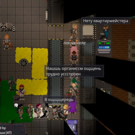
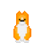

[Командование](/roles/command)

# Глава Персонала

**Сложность:** Сложная

**Обязанности:** Руководит отделом Сервиса. Принимает и увольняет работников, редактирует доступ ID-карт.
**Руководители**: [Капитан](/roles/captain)
**Руководства**: [Иерархия Командования](/guides/hierarchyofcommand)

10

0

|  | Вы - оплот бюрократии на станции! Лишь за вами стоит решение, будет ли ассистент брать разрешение на использование швабры у уборщика или сможет зайти в любую дверь просто попросив у вас доступы. Постарайтесь сохранить баланс бумажек и здравого смысла... |
| --- | --- |

Глава Персонала (также его называют ХоП) возглавляет отдел Сервиса и отвечает за перераспределение кадров, выдачу удостоверений личности и запасных ПДА. Вы являетесь правой рукой капитана, и если капитан вдруг пропадет, вы должны будете занять его место.

Наряду с капитаном, должность Главы персонала является одной из самых рискованных, поскольку ваши ID-карта и ID-консоль являются ключом к неограниченному доступу в любую точку станции. Не исключено, что кто-то воспользуются возможностью получить расширенный доступ, если представится такой шанс, поэтому будьте начеку.

## Смена должностей и доступа

В зависимости от численности экипажа, очередь у стойки Главы персонала может заполниться еще до того, как вы успеете погладить Иана: многие члены экипажа, не получившие желаемую работу, будут бороться за ваше внимание и смену удостоверения. Поддерживайте хотя бы видимость порядка и обслуживайте каждого обратившегося. Пока вы быстро справляетесь с делами, экипаж будет вести себя прилично.

Будьте осторожны при распределении вакансий и просьбах о дополнительном доступе. Если член экипажа просит о переводе или дополнительном доступе в другой отдел, то необходимо ~~получить взятку~~ уведомить Главу этого отдела и/или попросить члена экипажа получить бумагу с печатью руководителя, к которому он переходит. Это может показаться лишней бюрократией, но это гарантирует, что Главы будут знать, что происходит. Также это отсеет тех, кто предпочитает, чтобы начальник отдела не знал, что он замышляет.

## Замена пропавшего ПДА

Члены экипажа часто становятся незадачливыми жертвами краж, и удостоверения личности - одни из самых распространенных предметов, которые крадут по разным причинам. Если член команды заявляет, что его ID или ПДА украдены, вы можете выдать им новый. Однако будьте осторожны, чтобы не быть обманутым. Член экипажа может легко переодеться в комбинезон, не связанный с работой, и заявить, что у него украли удостоверение, а на самом деле он просто спрятал его в сумку. Когда вы дадите им новое удостоверение, скажем, инженера, они уйдут со словами "Спасибо" и теперь у них есть и инженерное удостоверение, и удостоверение ученого.

##  Иан

Ваш личный корги. Защита Иана - это, пожалуй, самая важная задача Главы персонала. Он должен быть в безопасности даже ценой вашей жизни.

## Управление человеческими ресурсами

Глава персонала является довольно многогранной ролью. Обычно вы можете либо наслаждаться престижем, либо оказаться прикованным к стулу в своем кабинете. Если вы оказались в голубом кителе, извлеките максимум пользы, выполняя свою работу правильно.

* Поддержите Капитана. Убедитесь, что в каждом отделе имеется Глава. Заработайте доверие, часто используя командный канал и обсуждая важные вопросы, такие как назначение новых руководителей или вызов шаттла. Вы тот, кто возьмет на себя обязанности Капитана, если тот решит уйти в отставку. Так что было бы неплохо показать себя хорошим лидером перед коллегами.
* При выдаче новых уровней доступа или создании новых рабочих мест, спросите себя, какой объем доступа необходим для выполнения задачи. Если трудолюбивый Инженер хочет получить доступ в EVA, подумайте, нужен ли ему доступ, или просто откройте для него дверь, пока он получает костюм. Но если парамедик часто ждёт, чтобы ему открыли двери, выгода от повышения его доступа превышает риски. Подобные решения делают станцию более безопасной и сокращают количество арестов за проникновение. Не забудьте оповестить Глав о новых привилегиях, чтобы уборщик не был арестован за уборку в бриге.
* Говорите с экипажем. Капитан слишком занят, чтобы опускаться до проблем работяг, Глава Службы Безопасности сосредоточен на контроле своего отдела по контролю, Научный руководитель буквально горит, Главный врач по локоть в трупах, а Старший Инженер пытается заставить всех дышать в вакууме. Вы - единственный руководитель, способный уделить время и выслушать людей. Приглашайте членов экипажа поговорить с вами, когда возникают конфликты. Разрядите межличностные и междепартаментные проблемы, которые вы обнаруживаете во время этих разговоров, чтобы недовольство не переросло в беду. Защищайте права сотрудников от произвола охраны, и в целом снижайте уровень недовольства.
* Не забывайте о своем департаменте. Управление сотрудниками Сервиса, у которых не имеется другого главы, кроме вас, является вашей непосредственной обязанностью. Проводите также инспекции в другие отделы. Химики варят наркотики, ботаники выращивают наркотики, а инженеры их употребляют и думают, что могут при этом безнаказанно халявить? Ворвитесь в их пучину безделья и некомпетентности, раздайте форсирующих подзатыльников, увольте, если дела совсем плохи.

[**Профессии экипажа**](https://js.ss14.su/roles)

**Командование**

[Капитан](/roles/captain)
[Глава персонала](/roles/headofpersonnel)
[Глава Службы Безопасности](/roles/headofsecurity)
[Инспектор](/roles/inspector)
[Старший Инженер](/roles/chiefengineer)
[Научный Руководитель](/roles/researchdirector)
[Старший Медицинский Офицер](/roles/chiefmedicalofficer)
[Квартирмейстер](/roles/quartermaster)

**Центральное Командование**

[Представитель ЦК](/roles/representativeofcc)
[Отряд Быстрого Реагирования](/roles/emergencyresponseteam)
[Отряд Смерти](/roles/deathsquad)

**Служба безопасности**

[Глава Службы Безопасности](/roles/headofsecurity)
[Смотритель](/roles/warden)
[Ветеран](/roles/veteran)
[Офицер](/roles/officer)
[Детектив](/roles/detective)
[Кадет](/roles/cadet)

**Инженерный отдел**

[Старший Инженер](/roles/chiefengineer)
[Бригадир](/roles/brigadier)
[Инженер](/roles/engineer)
[Атмосферный техник](/roles/atmospherictechnician)
[Технический ассистент](/roles/technicalassistant)

**Отдел Исследований**

[Научный Руководитель](/roles/researchdirector)
[Ведущий исследователь](/roles/leadresearcher)
[Учёный](/roles/scientist)
[Научный ассистент](/roles/researchassistant)

**Медицинский отдел**

[Старший Медицинский Офицер](/roles/chiefmedicalofficer)
[Медицинский офицер](/roles/medicalofficer)
[Парамедик](/roles/paramedic)
[Химик](/roles/chemist)
[Врач](/roles/doctor)
[Интерн](/roles/intern)

**Отдел снабжения**

[Квартирмейстер](/roles/quartermaster)
[Охотник](/roles/hunter)
[Утилизатор](/roles/utilizer)
[Грузчик](/roles/loader)

**Отдел юстиции**

[Инспектор](/roles/inspector)
[Юрист](/roles/lawyer)

**Сервисный отдел**

[Глава персонала](/roles/headofpersonnel)
[Ассистент](/roles/assistant)
[Сервисный работник](/roles/serviceworker)
[Ботаник](/roles/botanist)
[Шеф-повар](/roles/chef)
[Бармен](/roles/barman)
[Уборщик](/roles/janitor)
[Клоун](/roles/clown)
[Мим](/roles/mime)
[Зоотехник](/roles/zootechnik)
[Боксёр](/roles/boxer)
[Репортёр](/roles/reporter)
[Священник](/roles/priest)
[Библиотекарь](/roles/librarian)
[Музыкант](/roles/musician)

**Спиритический отдел**

[Призрак](/roles/ghost)
[Мышь](/roles/mouse)
[Гамлет](/roles/hamlet)
[Ремилия](/roles/remilia)

**Синтетики**

[Киборг](/roles/cyborg)
[пИИ](/roles/personalai)
[Дрон техобслуживания](/roles/maintenancedrone)
[Искусственный Интеллект](/roles/ai)

**Антагонисты**

[Предатель](/roles/traitor)
[Ядерный оперативник](/roles/nuclearoperative)
[Мозговой червь](/roles/corticalBorer)
[Вор](/roles/thief)
[Культист](/roles/cultist)
[Революционер](/roles/revolution)
[Нулевой пациент](/roles/patientzero)
[Космический ниндзя](/roles/spaceninja)
[Пират](/roles/pirate)
[Ревенант](/roles/revenant)
[Крысиный король](/roles/ratking)
[Космический дракон](/roles/spacedragon)
[Хранитель](/roles/guardian)
[Генокрад](/roles/genestealer)
[Терминатор](/roles/terminator)