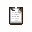

[Командование](/roles/command)

# Глава Службы Безопасности

**Сложность:** Сложная

**Обязанности:** Хранить порядок на станции, хранить капитана живым, хранить себя живым.
**Руководители**: [Капитан](/roles/captain)
**Руководства**: [Иерархия Командования](/guides/hierarchyofcommand) • [Космический Закон](/spacelaw) • [Десятичные коды](/roles/securityservicedepartment/tencodes)

Глава Службы Безопасности  VS  Клоун

ХОС HP: 30

ХОС MP: 10

---

Клоун HP: 45

Клоун MP: 20

Атака
Лечение
Перезарядка

Быть главой всего СБ, которому поручено защищать всю станцию и ее экипаж - непросто. ОЧЕНЬ непросто. Но, может быть, вы сможете привести свою скромную команду к победе над врагами NanoTrasen.

Минимальные требования: Старайтесь поддерживать жизнь своей команды, работая вместе, общаясь, сосредотачиваясь на более крупной рыбе, а не на маленьких серых пиявках. Сделайте все, чтобы не стать щиткуритоном.

## Миротворец

[**Руководство по службе безопасности. Обязательно прочтите его, если вы хотите стать компетентным Главой СБ.**](/guides/officership)

Как глава СБ, вы обязаны следить за бригом, мостиком и тем, чтобы ваши офицеры не испортили все окончательно. В ваши прямые обязанности не входит поимка и арест людей, если только это не срочное дело в одном из многочисленных мест, куда обычные сотрудники службы безопасности не могут попасть, поэтому обычно вы можете просто сидеть в своем кабинете и позволять секьюритронам и краснорубашечникам делать всё за вас. У вас больше доступа к станции, чем у любого другого сотрудника службы безопасности, но меньше, чем у других глав. Постарайтесь не зависеть от них.

## Ваш офис

Ваш офис находится в Бриге. В нем есть несколько видов оружия, спец. устройств, зарядное устройство и 2 терминала безопасности, а также ваш личный, чуть более бронированный, чем остальные, скафандр с уникальным внешним видом. В комплект также входят ваши обычные канцелярские принадлежности, ваш уникальный штамп, терминал для ключей и кнопка для закрытия ставен на окнах.

Содержимое кабинета включает в себя пояс офицера, комплект запасной одежды, [дизейблер](/guides/securityinventory), джетпак, модный плащ и пульт дистанционного управления дверьми. Рекомендуется взять большинство из этих вещей, так как они могут пригодиться, когда они действительно понадобятся. В кабинете также лежат некоторые вещи, например автоматическая винтовка WT-550, в зависимости от щедрости Центрального Командования.

##  Ваши подчиненные

Как руководитель службы безопасности, вы отвечаете за множество сотрудников своего отдела. Важно не потерять их из виду и убедиться, что они правильно выполняют свою работу. В вашем ведении находятся следующие люди:

| Подчиненный | Описание |
| --- | --- |
|  [Ветеран](/roles/veteran) | Старичёк в деле охраны и защиты станции от надвигающихся угроз. Имеет большой опыт, поэтому его задача - помогать, обучать и наставлять других сотрудников Брига. В начале смены на бриффинге можете выбрать ему кадета для обучения либо дать ему возможнось самому это сделать. В любом случае, он должен кого-то обучать, для этого он сюда и прилетел. |
|  [Смотритель](/roles/warden) | Сторожевой пес Брига. Следите за тем, чтобы он держал под контролем все таймеры на камерах содержания заключенных, поддерживал работу Брига и не покидал его, пока там находятся заключенные. Он следующий в очереди на вашу должность, если вас сместят, и ваш самый старший лейтенант. Относитесь к нему как к своей правой руке, поскольку в большинстве ситуаций он сможет прекрасно управлять Бригом в одиночку. |
|  [Детектив](/roles/detective) | Просто позвольте ему заниматься своим делом. Он привык работать с достаточной степенью автономии от остального коллектива. Просто не забывайте время от времени интересоваться его делами и будьте готовы послать краснорубашечников, если он раскроет что-то серьезное. |
|  [Офицер Службы Безопасности](/roles/officer) | Это ваши пешки и ваша задача — грамотно управлять ими. По прибытию на станцию инструктируйте каждого офицера и выдавайте им задания. Требуйте от них дисциплины, орите на них, если потребуется. Эффективным средством бывает так же посадить особо непонимающих офицеров в камеру. В крайнем случае не брезгуйте увольнять их и просить у Главы Персонала новых. Иногда в вашей команде может появиться новый игрок, поэтому не стоит слишком усердствовать с ним. |
|  [Кадет](/roles/cadet) | Кадеты - это продуценты в экологической пирамиде Брига. Ещё зелёные как травка. В начале смены на бриффинге назначьте по кадету на каждого офицера, чтобы они обучались и были под пресмотром, а то заманят в дормы бедненьких. Если остались лишние кадеты, то направьте их на обучение к [Смотрителю](/roles/warden) или отдайте на попечительство [Ветерану](/roles/veteran), который уже пояснит им правила здешних мест и основы. |

##  Назначение офицеров в отделы

Каждый офицер может быть пристроен вами к какому-либо отделу. Офицерам отдела предоставляется собственный небольшой офис, откуда бдительный страж сможет контролировать порядок в отделе. Ваша задача — убедиться, что каждый отдел укомплектован сотрудником службы безопасности. Если отдел становится очагом преступной деятельности, может быть, хорошей идеей будет перераспределить больше людей в этот отдел.

## Игровые режимы

### [Et tu, Brute?](/roles/traitor)

Самый стандартный и известный всеми режим. На станцию, под видом экипажа, проникает несколько агентов синдиката. Каждый из них получил от начальства особый "магазин" оружия - [аплинк](/guides/uplink) и специальные задания, которые необходимо выполнить. Агенты ничего не знают о друг-друге, но имеют специальные секретные слова, позволяющие узнать другого агента из массы экипажа без раскрытия своей роли всем окружающим.

Как Главы Службы Безопасности, ваша задача - грамотно распределить силы Службы Безопасности, чтобы вычислить и нейтрализовать как можно больше агентов. Возможно, вам прийдется столкнуться с активным сопротивлением, если какой-то из агентов почувствует в себе силы действовать открыто. В таком случае все будет зависеть от боевых качеств всего состава СБ.

###  [Ядерная зима](/roles/nuclearoperative)

Красные скафандры, мертвый [Капитан](/roles/captain), взорванный медбей, о Боже! Ядерная чрезвычайная ситуация — это, пожалуй, одни из самых сложных раундов для начальника службы безопасности, требующие большого количества знаний и умения противостоять ударной группе террористов на борту станции. Суть такова: есть чертов диск и вам нужно его сохранить. У всех оперативников есть свои пинпоинтеры, поэтому помните, что прятать диск не стоит, так как они могут его легко отследить. На станции также имеются несколько таких - в Хранилище и каюте капитана.

При объявлении войны со стороны Синдиката, вы будете вынуждены в срочном порядке вооружить весь состав станции (да, даже клоуна). Закажите в Карго ящики с оружием и боеприпасами к ним, пуленепробиваемыми жилетами с касками и начните устанавливать оборонительные сооружения по всей станции. Если вы не доверяете безопасность диска капитану или другим главам, возьмите эту ответственность на себя, стараясь держаться подальше от поля боя и надеяться на бравых пассажиров, стоящих на баррикадах.

Вы все таки потеряли диск? Это еще не конец, так что не бойтесь надеть свой скафандр и преследовать этих ублюдков прямо до их собственного шаттла. Никогда не теряйте надежду.

## "Полезные" советы

* Если вы промаркируете все вооружение в арсенале и все снаряжение, которые вы раздаете, вы будете точно знать, кто и как облажался, когда дробовик окажется в руках у клоуна.
* Если вы заполните баллон с воздухом 20% O2 и 80% N2O, установите давление 101 кПа и наденете на кого-нибудь вместе с маской и включите подачу смеси, то можно устроить ему участь хуже смерти почти на вечность.
* Вы можете пополнить оружейную, заказав оружие в карго, чтобы в случае опасности большее количество людей могло дать отпор.
* Если взять дробовик, ~~наполнить его картечью,~~ и отпилить циркулярной пилой ствол — вы сможете положить его в рюкзак, что станет отличным противодействием пользователям энергетических мечей/щитов.
* Не забывайте отслеживать жизненные показатели ваших офицеров, вколов им имплант "Трекер". Вы же не хотите получить переодетого предателя в своей команде?

[**Профессии экипажа**](https://js.ss14.su/roles)

**Командование**

[Капитан](/roles/captain)
[Глава персонала](/roles/headofpersonnel)
[Глава Службы Безопасности](/roles/headofsecurity)
[Инспектор](/roles/inspector)
[Старший Инженер](/roles/chiefengineer)
[Научный Руководитель](/roles/researchdirector)
[Старший Медицинский Офицер](/roles/chiefmedicalofficer)
[Квартирмейстер](/roles/quartermaster)

**Центральное Командование**

[Представитель ЦК](/roles/representativeofcc)
[Отряд Быстрого Реагирования](/roles/emergencyresponseteam)
[Отряд Смерти](/roles/deathsquad)

**Служба безопасности**

[Глава Службы Безопасности](/roles/headofsecurity)
[Смотритель](/roles/warden)
[Ветеран](/roles/veteran)
[Офицер](/roles/officer)
[Детектив](/roles/detective)
[Кадет](/roles/cadet)

**Инженерный отдел**

[Старший Инженер](/roles/chiefengineer)
[Бригадир](/roles/brigadier)
[Инженер](/roles/engineer)
[Атмосферный техник](/roles/atmospherictechnician)
[Технический ассистент](/roles/technicalassistant)

**Отдел Исследований**

[Научный Руководитель](/roles/researchdirector)
[Ведущий исследователь](/roles/leadresearcher)
[Учёный](/roles/scientist)
[Научный ассистент](/roles/researchassistant)

**Медицинский отдел**

[Старший Медицинский Офицер](/roles/chiefmedicalofficer)
[Медицинский офицер](/roles/medicalofficer)
[Парамедик](/roles/paramedic)
[Химик](/roles/chemist)
[Врач](/roles/doctor)
[Интерн](/roles/intern)

**Отдел снабжения**

[Квартирмейстер](/roles/quartermaster)
[Охотник](/roles/hunter)
[Утилизатор](/roles/utilizer)
[Грузчик](/roles/loader)

**Отдел юстиции**

[Инспектор](/roles/inspector)
[Юрист](/roles/lawyer)

**Сервисный отдел**

[Глава персонала](/roles/headofpersonnel)
[Ассистент](/roles/assistant)
[Сервисный работник](/roles/serviceworker)
[Ботаник](/roles/botanist)
[Шеф-повар](/roles/chef)
[Бармен](/roles/barman)
[Уборщик](/roles/janitor)
[Клоун](/roles/clown)
[Мим](/roles/mime)
[Зоотехник](/roles/zootechnik)
[Боксёр](/roles/boxer)
[Репортёр](/roles/reporter)
[Священник](/roles/priest)
[Библиотекарь](/roles/librarian)
[Музыкант](/roles/musician)

**Спиритический отдел**

[Призрак](/roles/ghost)
[Мышь](/roles/mouse)
[Гамлет](/roles/hamlet)
[Ремилия](/roles/remilia)

**Синтетики**

[Киборг](/roles/cyborg)
[пИИ](/roles/personalai)
[Дрон техобслуживания](/roles/maintenancedrone)
[Искусственный Интеллект](/roles/ai)

**Антагонисты**

[Предатель](/roles/traitor)
[Ядерный оперативник](/roles/nuclearoperative)
[Мозговой червь](/roles/corticalBorer)
[Вор](/roles/thief)
[Культист](/roles/cultist)
[Революционер](/roles/revolution)
[Нулевой пациент](/roles/patientzero)
[Космический ниндзя](/roles/spaceninja)
[Пират](/roles/pirate)
[Ревенант](/roles/revenant)
[Крысиный король](/roles/ratking)
[Космический дракон](/roles/spacedragon)
[Хранитель](/roles/guardian)
[Генокрад](/roles/genestealer)
[Терминатор](/roles/terminator)